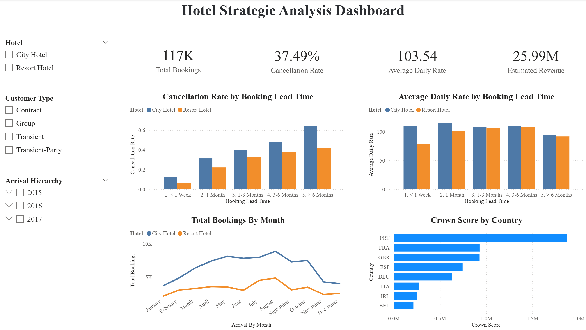

# 🏨 Hotel Booking Business Intelligence & Revenue Optimization

## 📌 Project Overview
This project provides a multi-tool diagnostic of the hotel group's operational health using a dataset of **119,000+ records**. 

Beyond static analysis, I developed a **full-scale Interactive Business Intelligence Dashboard** to bridge the gap between raw SQL data and executive decision-making. By identifying a **42% cancellation rate** at City Hotels and defining the **"Death Zone" of lead times**, this project offers actionable strategies for loss prevention and revenue harvesting.

**Live Interaction:** [Link to your Portfolio/Screenshot] 
*(Note: Replace with your actual screenshot or Power BI Service link)*

---

## 📊 Dashboard Preview

*Figure 1: Final Interactive Dashboard featuring Global KPIs, Risk Diagnosis, and Market Ranking.*

---

## 🎯 Business Objectives
*   **Loss Diagnosis**: Pinpoint "leakage points" in the booking funnel and high-risk lead time windows.
*   **Revenue Optimization**: Analyze ADR (Average Daily Rate) to stop "Panic Slashing" in Resort segments.
*   **Interactive Intelligence**: Enable stakeholders to filter performance by Hotel Type, Quarter, and Market.
*   **Strategic Action**: Automate the identification of the **"Crown Jewel"** markets using custom scoring.

---

## 🛠️ Tech Stack & Skills
*   **Database**: SQL (SQLite) for high-performance data sanitization and aggregation.
*   **BI & Visualization**: 
    *   **Power BI**: Interactive dashboarding, DAX (Data Analysis Expressions), and Power Query.
    *   **Python (Seaborn/Matplotlib)**: Exploratory Data Analysis (EDA) and statistical charting.
*   **Skills**: Data Modeling, Revenue Management Logic, Customer Segmentation, ETL Processes.

---

## 📈 Analysis Framework & BI Features

### 1. Data Integrity & ETL (SQL & Power Query)
*   Cleaned "Ghost Bookings" (0 guests) and filtered negative ADR anomalies.
*   Handled circular dependencies and date sorting logic via Power Query to ensure a seamless chronological flow (Jan-Dec).

### 2. Loss Diagnosis: The "Death Zone"
*   **Finding**: Bookings made **>180 days** in advance have a **64.2% failure rate**.
*   **BI Feature**: Dynamic "Cancellation by Lead Time" chart allows managers to see risk spikes across different customer segments in real-time.

### 3. Revenue Mining: Harvest vs. Clearance
*   **Finding**: City Hotels effectively use "Last-Minute Premiums," while Resort Hotels suffer from "Perishable Inventory" panic.
*   **BI Feature**: Real-time ADR tracking against booking windows to monitor pricing health.

### 4. The "Crown Score" Market Ranking
Developed a custom metric: 
$$\text{Crown Score} = \text{Total Volume} \times \text{Success Rate} \times \text{ADR}$$
*   **Interactive Leaderboard**: An auto-sorting bar chart that identifies top-tier markets (e.g., **France - Transient**) at the click of a filter.

---

## 💡 Strategic Recommendations

### 🏙️ City Hotel: Tighten Risk Management
*   **Tighten Cancellation Policies**: Implement mandatory non-refundable deposits for any booking with a Lead Time exceeding 90 days.
*   **Audit B2B Contracts**: Renegotiate terms with Offline Travel Agents and "Group" coordinators to reduce the 48%+ default rate.
*   **Capitalize on French Market**: Allocate a significant share of the marketing budget toward French transient travelers.

### 🏖️ Resort Hotel: Protect ADR
*   **Stabilize Last-Minute Pricing**: Replace aggressive price slashing with "Value-Add" offers (e.g., free spa/dinner) to maintain ADR.
*   **Cultivate Family Segment**: Invest in family-centric amenities to increase the volume of this high-margin (+$60 premium) segment.
*   **British Anchor**: Deepen relationships with UK (GBR) agents; their **99.9% success rate** makes them perfect "occupancy fillers."

---

## 📂 Project Structure
```text
Hotel-Booking-Analysis/
├── data/                       # Original dataset (Kaggle)
├── dashboard/                  # .PBIX file (Power BI Project)
├── sql_code/                   # SQL scripts for Cleaning & Analysis
├── visualization_py_code/      # Static visualization code
├── sql_output/                 # SQL codes' execution results as CSVs
├── visualization_output/       # Static visualization results as PNGs
├── scripts                     # Completed report as a PDF
└── README.md                   # Project documentation